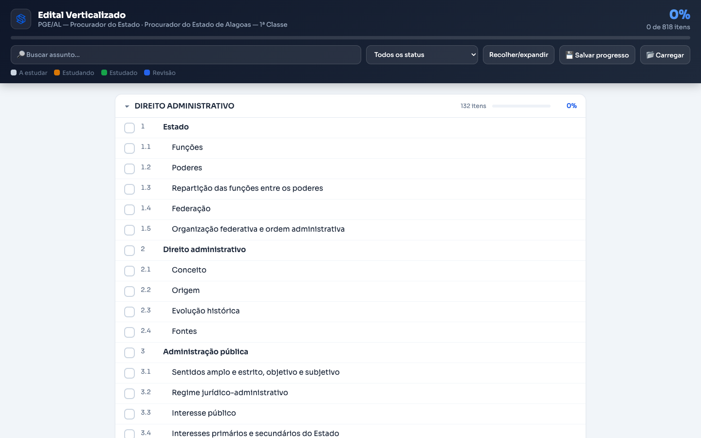

<p align="center">
  
</p>

<h1 align="center">Edital Verticalizado — plano de estudo em 3 formatos</h1>

<p align="center">
  <a href="https://simiao-cavalcante.github.io/edital-verticalizado/"></a>
  
  
  <a href="LICENSE"></a>
  
</p>

<p align="center">
  🌐 <b><a href="https://simiao-cavalcante.github.io/edital-verticalizado/">Página do projeto</a></b> ·
  🖥️ <b><a href="https://simiao-cavalcante.github.io/edital-verticalizado/demo/painel-pge-al.html">Demo ao vivo</a></b> ·
  ⬇️ <b><a href="https://github.com/simiao-cavalcante/edital-verticalizado/raw/main/verticalizar-edital-pro.skill">Baixar a skill</a></b>
</p>

Uma **skill** que transforma o edital de **qualquer concurso público** num **plano de estudo acompanhável**, em três formatos gerados de uma única extração:

- 📊 **Excel** — planilha viva: status por item, incidência, **% de cobertura por disciplina** (com gráfico) e dropdowns.
- 🖥️ **HTML** — painel interativo: marque o progresso, disciplinas recolhíveis, busca e filtro, **salvo no navegador** e com **Salvar/Carregar progresso** (backup em `.json`). [Veja funcionando →](https://simiao-cavalcante.github.io/edital-verticalizado/demo/painel-pge-al.html)
- 📄 **DOCX** — versão imprimível, com caixas ☐ pra marcar à mão.

> **A IA organiza, você decide.** A skill nunca "chuta" o que mais cai — ela estrutura o edital fielmente e te dá o controle.

<p align="center">
  
  <br><sub>O painel interativo com um edital real: PGE-AL, Procurador do Estado — 11 disciplinas, 818 itens.</sub>
</p>

---

## ✨ O que ela faz

- Lê o **PDF do edital**, **detecta os cargos/especialidades** e deixa você escolher um.
- Extrai disciplinas, assuntos e subitens **preservando a numeração e a ordem** do edital (distingue número de item de número de lei).
- Separa **Conhecimentos Gerais** (comuns) dos **Específicos** do cargo escolhido.
- Gera os 3 formatos prontos para estudar e acompanhar.

## 🧩 Como instalar

**Claude (app ou web):** baixe o arquivo [`verticalizar-edital-pro.skill`](verticalizar-edital-pro.skill) e adicione na seção de **Skills / Capacidades** do Claude.

**Claude Code:** copie a pasta para `~/.claude/skills/verticalizar-edital-pro/` (ou descompacte o `.skill` lá).

**Pré-requisitos (Python):**
```bash
pip install pymupdf openpyxl python-docx
```

## 🚀 Como usar

1. Acione a skill (ex.: *"verticalizar meu edital"*).
2. **Anexe o PDF do edital.**
3. Escolha o **cargo/especialidade** (a skill lista os que encontrar no edital).
4. Escolha os **formatos** (Excel, HTML, DOCX — ou todos).
5. Pronto: receba os arquivos prontos pra estudar.

Uso direto pelos scripts (opcional):
```bash
python3 scripts/extrair_edital.py edital.pdf --listar
python3 scripts/extrair_edital.py edital.pdf --cargo "1" --out edital.json
python3 scripts/gerar_excel.py edital.json --out plano.xlsx
python3 scripts/gerar_html.py  edital.json --out painel.html
python3 scripts/gerar_docx.py  edital.json --out plano.docx
```

## 📂 Exemplos

A pasta [`exemplos/`](exemplos/) traz a saída real de um edital (TJRJ — Analista Judiciário, 356 itens) nos três formatos. Abra o `exemplo-tjrj.html` no navegador para ver o painel interativo.

## 🎯 Incidência (a parte honesta)

A coluna **Incidência** nasce como **"Sem dado"** de propósito. A IA não tem o histórico da sua banca de cabeça — então ela **não inventa** o que mais cai. Para preencher de verdade, junte os assuntos das **últimas provas reais da sua banca** e classifique cada item em Alta/Média/Baixa.

## 🛠️ Como funciona (para devs)

Arquitetura **"extrair uma vez → vários geradores"**: o edital vira um **JSON canônico** (fonte única) e cada formato é gerado a partir dele, garantindo conteúdo idêntico.

```
edital.pdf ─▶ extrair_edital.py ─▶ edital.json ─┬─▶ gerar_excel.py ─▶ .xlsx
                                                ├─▶ gerar_html.py  ─▶ .html
                                                └─▶ gerar_docx.py  ─▶ .docx
```

A extração de PDF é heurística (itens inline, ruído de página) — sempre confira o resumo impresso. Para fidelidade máxima, use um conteúdo programático já verticalizado em `.md`.

## 🎨 Marca (opcional)

Os arquivos exibem a logo em `assets/logo.png`. Para usar outra, substitua esse arquivo ou defina a variável de ambiente `EDITAL_LOGO` com o caminho de um PNG.

## 📜 Licença

[MIT](LICENSE) — uso livre, mantendo o crédito.

## 👤 Créditos

Criado por **Simião Cavalcante** — [Instagram @prof.simiao](https://www.instagram.com/prof.simiao) · [X @simiao_c](https://x.com/simiao_c). Contribuições e sugestões são bem-vindas — abra uma *issue* ou *pull request*.
